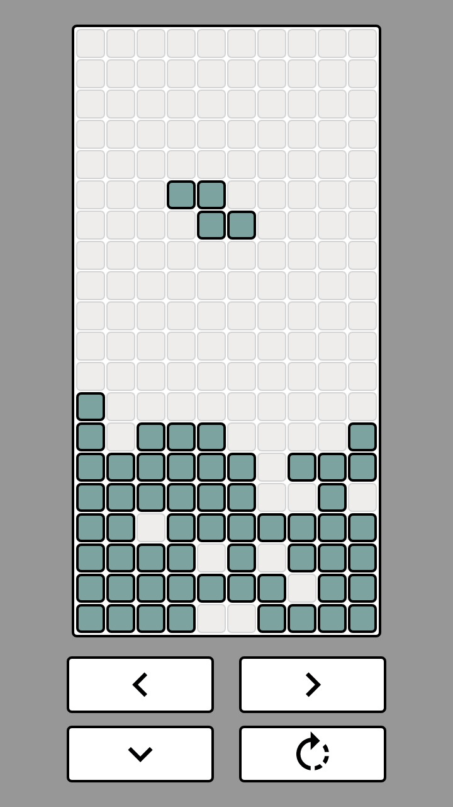

# TetrisGame
Tetris Game created in Android Studio

Random block of items drops down.

While block is moving down press left, right, down or rotate buttons to set the block at needed position.

If whole horizontal line is filled without gaps, it will change color, and will be swiped away. All items from upper positions will be moved to arrording down positions.

When game field is full, toast will show message that game is over.

